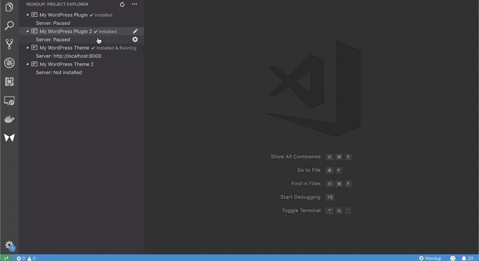
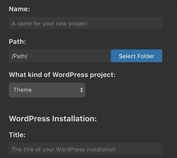

# Wordup for Visual Studio Code

The Wordup extension makes it easy to develop, manage and export WordPress plugins or themes from Visual Studio Code.

## Key Features

* Manage all your local WordPress projects directly in VSCode 
* Set up a new docker based development environment for your WordPress plugins/themes within minutes.
* Automatically install all necessary plugins and themes for WordPress. Even from local or remote zip-files.
* Export your plugin or theme to a zip-file. Or even export your whole project.

### Manage your WordPress projects:

### Create a new WordPress project:

> Tip: You can manage your WordPress installation settings always in your package.json of your project. 

## Requirements

You will need to [install Docker](https://docs.docker.com/install/) on your machine and set up on the system path.

## For more information 

* [Official website](https://wordup.dev): The official wordup website 
* [wordup-cli](https://github.com/wordup-dev/wordup-cli): The wordup CLI
* [Wordup on Github](https://github.com/wordup-dev/)

## Release Notes

See the [change log](CHANGELOG.md).

## License

See the [LICENSE](LICENSE) file for details